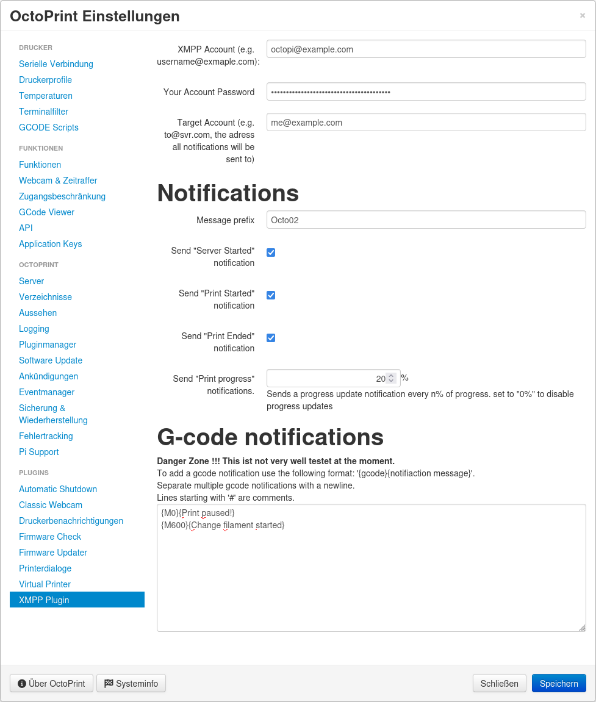

# octoprint xmpp plugin

Connect to a xmmp server and send printupdates

## Setup

Install via the bundled [Plugin Manager](https://docs.octoprint.org/en/master/bundledplugins/pluginmanager.html)
or manually using this URL:

    https://github.com/tobser/octoprint-xmpp-plugin/archive/main.zip

## Configuration

Enter Octoprints configuration site and select XMPP. Fill in the login details
for the account to connect to a xmpp server instance:

